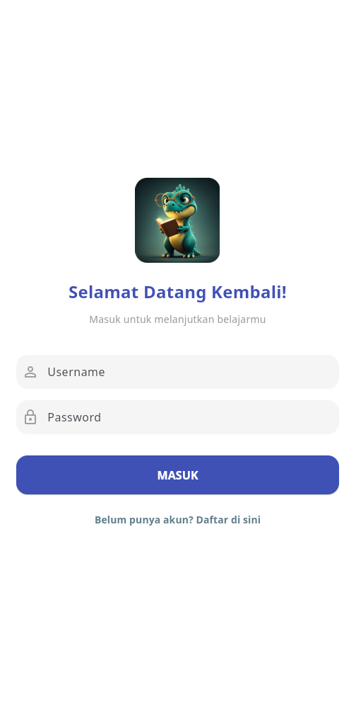
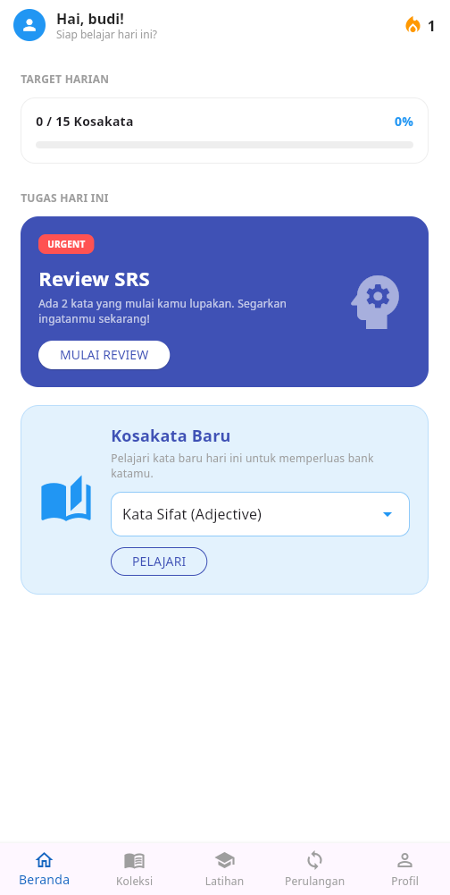
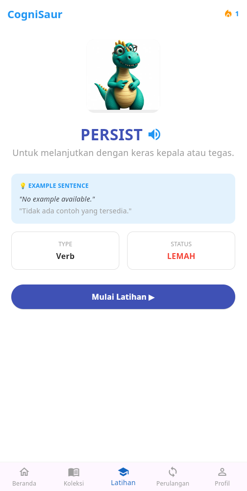
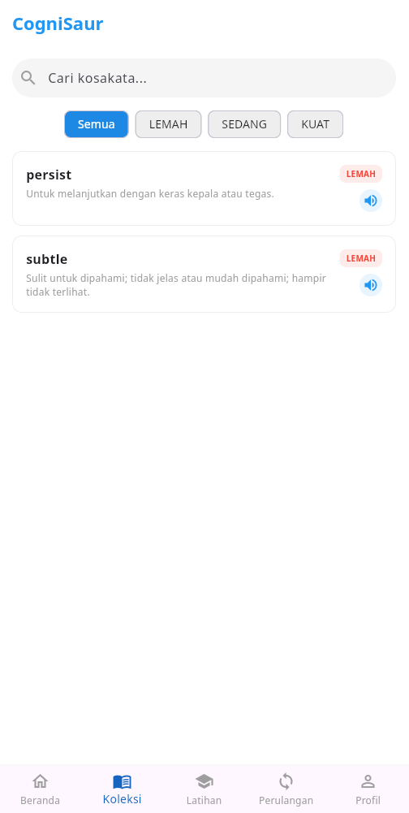
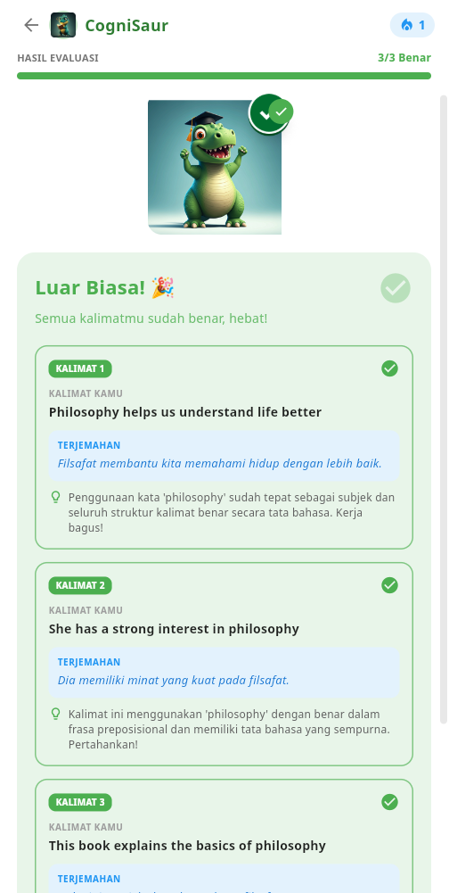
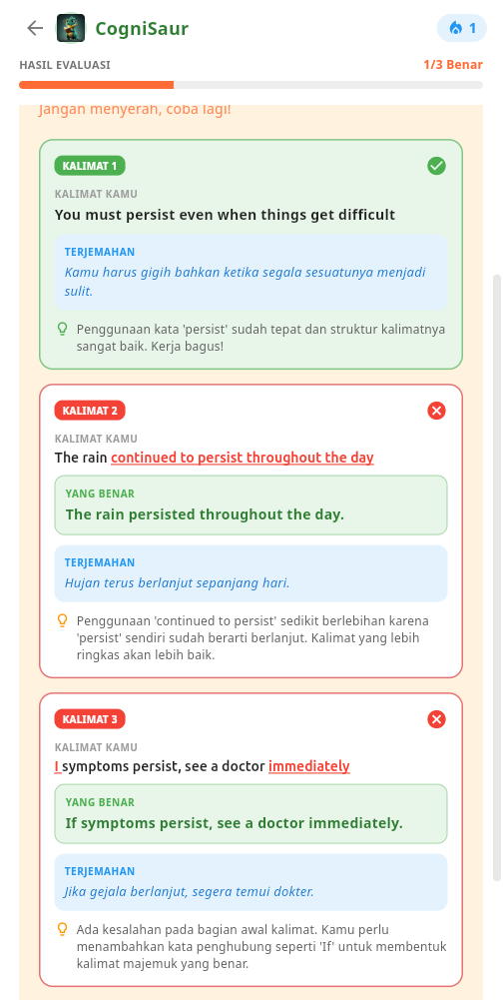
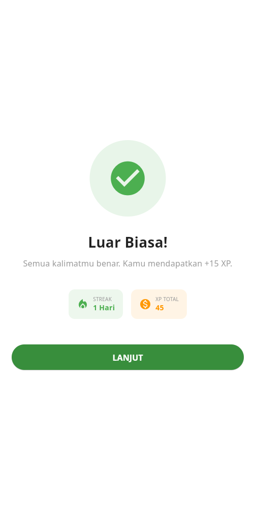
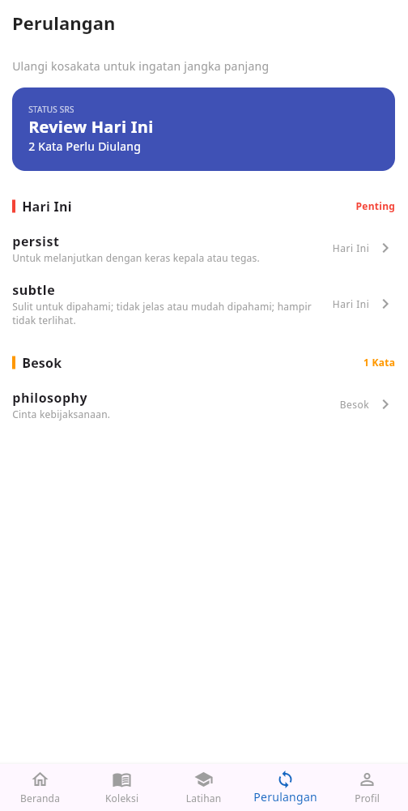
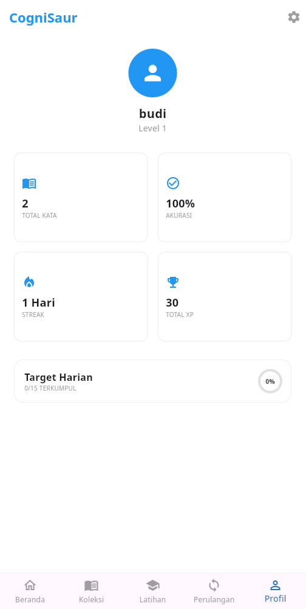

# CogniSaur

## Deskripsi Singkat Aplikasi

**CogniSaur** adalah aplikasi edukasi interaktif berbasis mobile (Flutter) yang dirancang untuk membantu pengguna mempelajari dan memperkuat retensi kosakata bahasa Inggris. Aplikasi ini menggunakan metode pembelajaran cerdas yang memastikan kata-kata yang sulit akan lebih sering diulang, sedangkan kata-kata yang sudah dikuasai akan lebih jarang muncul.

## Tujuan Pengembangan Aplikasi

Aplikasi ini dikembangkan untuk memfasilitasi pembelajaran kosakata yang efektif dan terstruktur. Tujuannya adalah untuk membantu pengguna membangun penguasaan bahasa secara bertahap melalui sistem evaluasi interaktif dan pelacakan kemajuan harian yang memotivasi pembelajaran yang konsisten.

## Daftar Fitur yang Tersedia

- **Autentikasi Pengguna**: Sistem pendaftaran dan login yang aman menggunakan username, email, dan kata sandi.
- **Spaced Repetition System (SRS)**: Algoritma cerdas yang menjadwalkan ulang kosakata berdasarkan tingkat pemahaman pengguna (Kuat, Sedang, Lemah).
- **Dynamic Daily Progress Tracker**: Pelacakan aktivitas harian dan hitungan *streak* pengguna untuk menjaga motivasi.
- **Text-to-Speech (TTS)**: Dukungan pelafalan audio otomatis untuk membantu pengguna mempelajari cara pengucapan kata yang benar.
- **Latihan Kosakata Dinamis**: Layar evaluasi interaktif dengan perbandingan teks cerdas (*case-insensitive*) dan antarmuka dinamis sesuai kategori kata (Noun/Verb/Adjective).

## Tangkapan Layar (Screenshots)

Berikut adalah antarmuka dari aplikasi CogniSaur:

<div align="center">
  
  &nbsp;&nbsp;&nbsp;&nbsp;
  
  &nbsp;&nbsp;&nbsp;&nbsp;
  
  &nbsp;&nbsp;&nbsp;&nbsp;
  
  &nbsp;&nbsp;&nbsp;&nbsp;
  
  &nbsp;&nbsp;&nbsp;&nbsp;
  
  &nbsp;&nbsp;&nbsp;&nbsp;
   
  &nbsp;&nbsp;&nbsp;&nbsp;
   
  &nbsp;&nbsp;&nbsp;&nbsp;
  
</div>

## Teknologi, Framework, Library, dan Komponen yang Digunakan

- **Frontend / Mobile**: Flutter (Dart)
- **Database**: SQLite (menyimpan kosakata, status SRS, dan akun pengguna secara lokal)
- **State Management / Penyimpanan**: SharedPreferences (melacak status sesi login)
- **Library Tambahan Utama**: `flutter_tts` (untuk Text-to-Speech)

## Struktur Database

Aplikasi menggunakan **SQLite** secara lokal di perangkat.

**Tabel `users`**
| Kolom | Tipe Data | Keterangan |
| --- | --- | --- |
| `id` | INTEGER | Primary Key, Auto Increment |
| `username` | TEXT | Nama pengguna |
| `email` | TEXT | Alamat email pengguna |
| `password` | TEXT | Kata sandi pengguna |

**Tabel `vocabularies`**
| Kolom | Tipe Data | Keterangan |
| --- | --- | --- |
| `id` | INTEGER | Primary Key |
| `word` | TEXT | Kosakata bahasa Inggris |
| `meaning` | TEXT | Arti dari kosakata |
| `type` | TEXT | Jenis kata (Noun / Verb / Adjective) |
| `srs_level` | TEXT | Status memori (Kuat / Sedang / Lemah) |

## Panduan Instalasi dan Menjalankan Aplikasi

### Persyaratan Sistem
- Flutter SDK (v3.0 atau yang lebih baru)
- Android Studio / VS Code dengan ekstensi Flutter
- Emulator Android atau Perangkat fisik Android/iOS

### Langkah-langkah Instalasi
1. Clone repositori ini:
   ```bash
   git clone <url-repository>
   cd cognisaur
   ```
2. Unduh dependensi:
   ```bash
   flutter pub get
   ```
3. Jalankan aplikasi:
   ```bash
   flutter run
   ```
